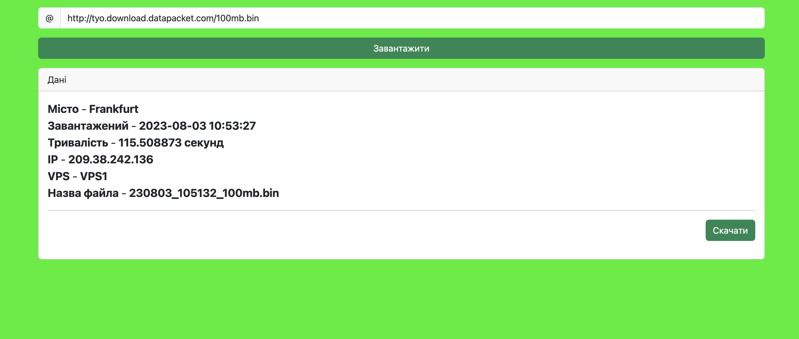
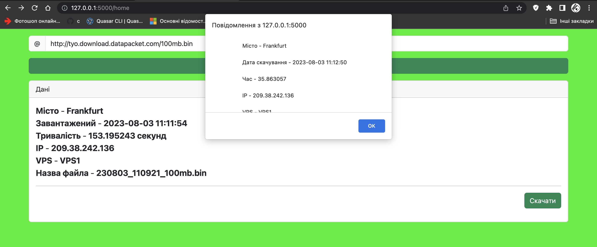

# Flask app
___

## Примітка
Реплікація працює автоматично після добавлення файла за допомогую bash script і команди rsync.

## Дії
1. Вставити посилання
   
2. Натиснути скачати
3. Результат
   
   

## Допрацювання
Оскільки метою було створення працюючої системи багато нюансів були не взяті до уваги.
1. Глобальна обробка помилок
2. Перенесення в env змінні sensitive data

## Пропозиція
1. Використання БД
